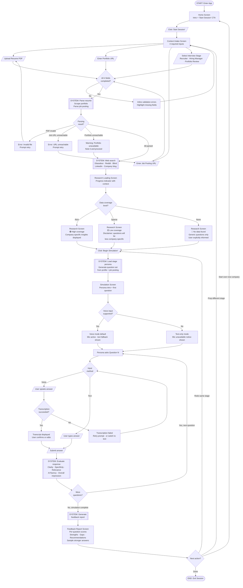

# Rehearse — User Flow Diagram

**14 screens/states · 8 decision points · 4 system processes · 3 error recovery paths**

---

---

## Key Design Decisions Captured

- **Portfolio failure is a warning, not a blocker** — app notes it and proceeds
- **Transcription failure has a clear recovery path** — retry or switch to text, never a dead end
- **Three post-report exits** — redo same stage, swap stage, fresh company — all must be visible on feedback screen
- **Research loading shows context** — "Searching Glassdoor, Reddit..." not a blank spinner
- **Data coverage is always disclosed** — three levels (rich / sparse / none), user never misled
